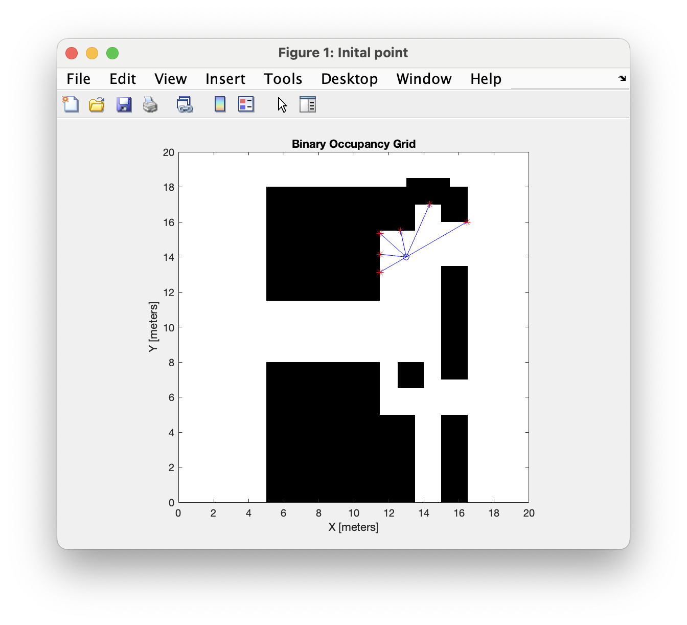
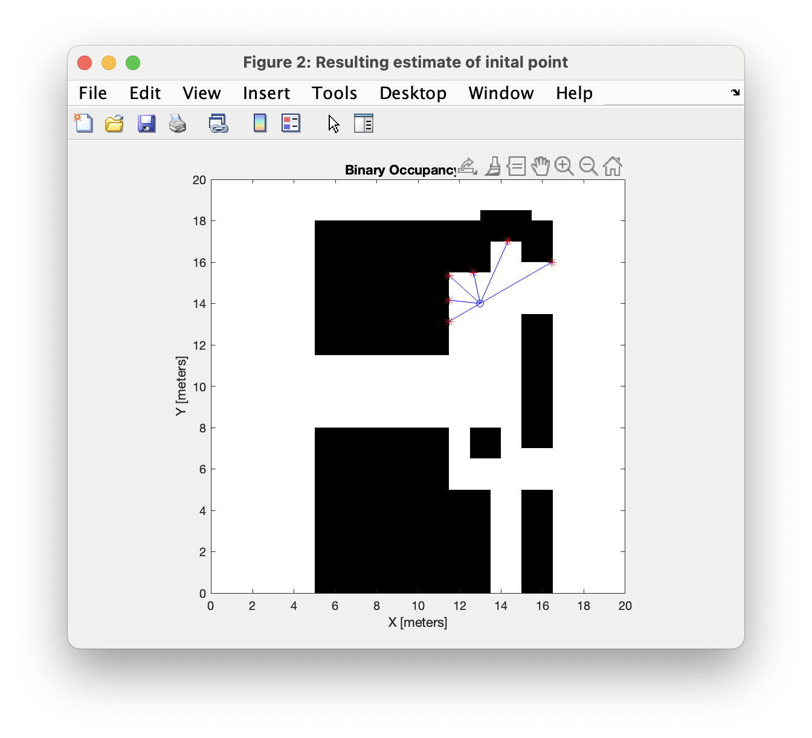
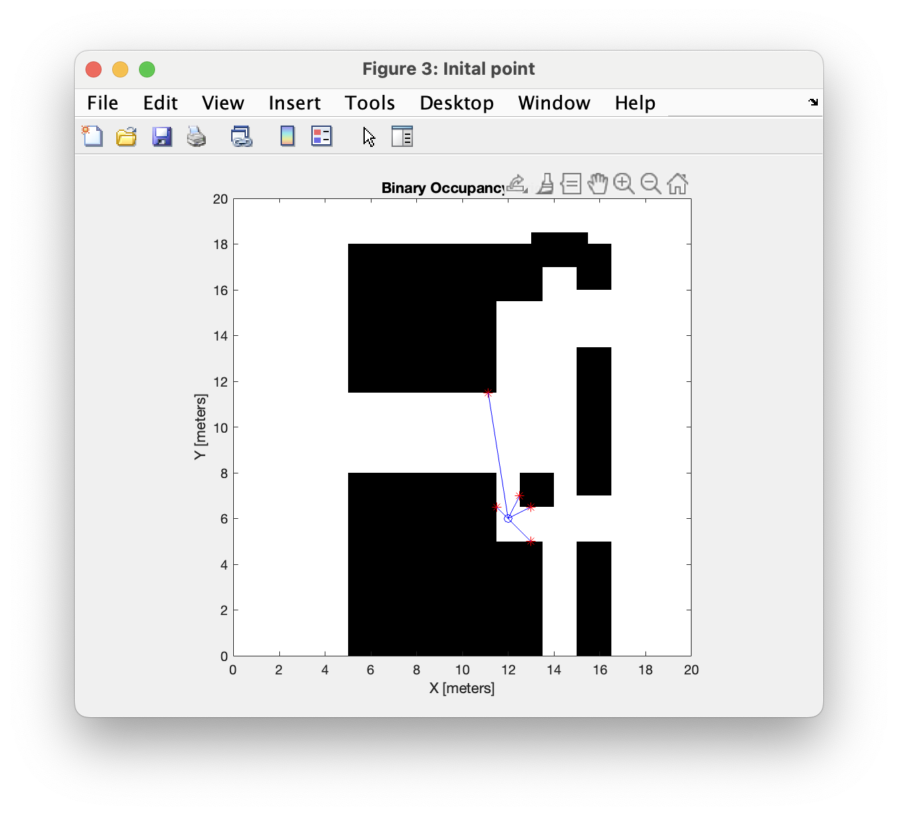
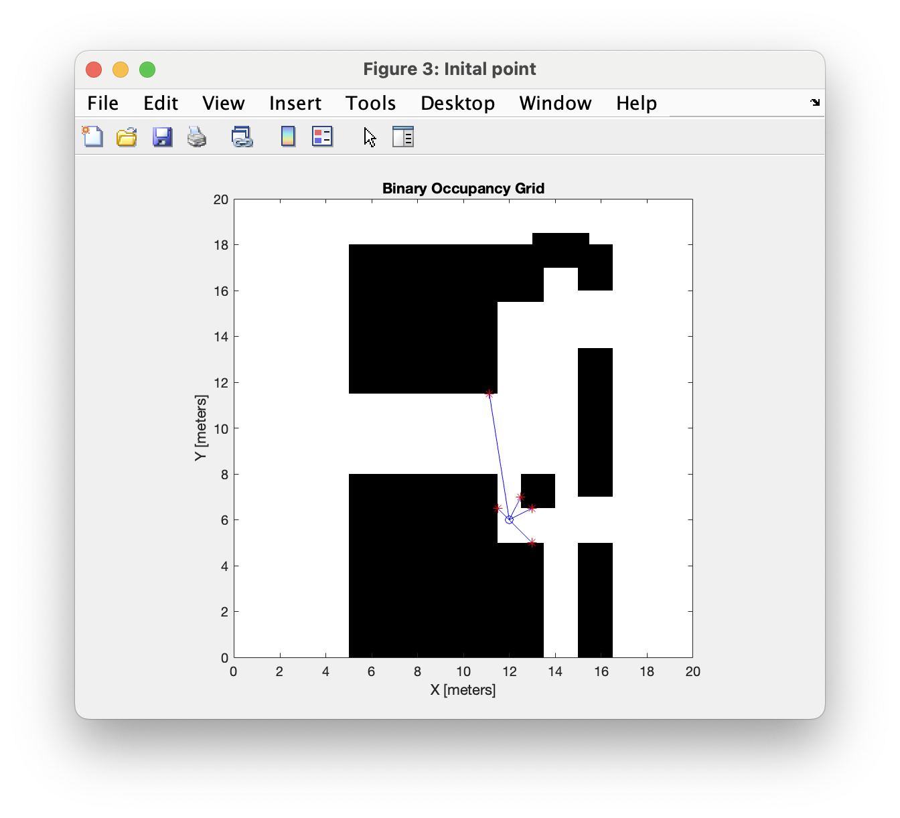

# local-robot
This repository provides robot localization scripts in MATLAB

## Setting
### Environment
In our 2-dimensional environment, a simulated robot is equiped with six laser sensors that measure the distance to the nearest object in a straight line. 

### Problem
We try to find the initial position of the robot only by his sensor measurements. To this end, we provide the algorithm with the initial measurements and search the environment using **genetic algorithm** and **particle swarm**. 

The optimization problem for robot localization can be formulated as:

$$
\begin{align*}
\min_{x, y, \theta} & \quad \|\mathbf{m}(x, y, \theta) - \mathbf{m}_0\|_2 \\
\text{subject to:} & \\
& 0 \leq x \leq 20 \\
& 0 \leq y \leq 20 \\
& 0 \leq \theta \leq 2\pi
\end{align*}
$$

where:
- $\mathbf{m}(x, y, \theta)$ is the vector of laser measurements at position $(x, y)$ with orientation $\theta$
- $\mathbf{m}_0$ is the vector of initial laser measurements
- $\|\cdot\|_2$ denotes the Euclidean norm

**Genetic Algorithm Setup**
- Population size: 1000 individuals
- Maximum generations: 1000

**Particle Swarm Setup**
- Swarm size: 1000 particles

**Common Features**
- Laser measurements at angles: $[-90°, -54°, -18°, 18°, 54°, 90°]$
- Maximum sensor range: 20 units
- Search space: $[0,20] \times [0,20] \times [0,2\pi]$
- Function tolerance: $10^{-3}$

## Results

### Genetic Algorithm

    

        
Initial position and laser measurements:

        
    

    

        
Final estimated position:

        
    

### Particle Swarm

    

        
Initial position and laser measurements:

        
    

    

        
Final estimated position:

        
    

The results show both algorithms successfully locating the robot's initial position based solely on laser measurements. The blue dots represent the robot's position, red stars show the intersection points of the laser beams with obstacles, and blue lines visualize the laser beams.
